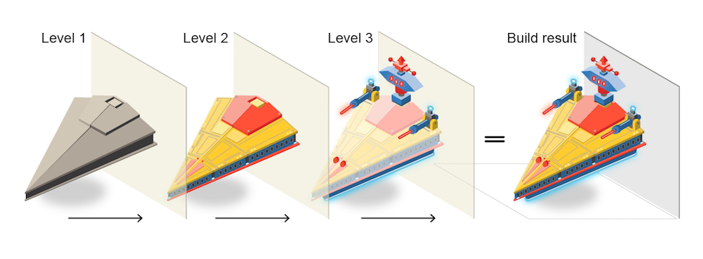

# BEM
文章主要介绍BEM基础思想和一些使用方法，以及在react，vue的框架中的应用。确保新手在入门中掌握对象开发的思想，合理安排设计自己的一套CSS体系。


## 导读

在小型手册网站上，如何组织你的风格通常不是一个大问题。你进入那里，写一些CSS，或者甚至是一些SASS。用SASS的生产设置将它编译到一个样式表中，然后将它聚合到一起，以便将模块中的所有样式表变成一个漂亮整洁的包。

然而，当涉及到更大，更复杂的项目时，组织代码的方式至少有以下三种方式是提高效率的关键：它影响编写代码需要多长时间，您需要多少代码写和你的浏览器将不得不做多少加载。当你与团队合作并且高性能是必不可少的时候，这变得尤为重要。

## 解决方法

|||||
------------ | :-----------: | -----------: |-----------: |
[OOCSS](http://oocss.org) | [SMACSS](http://smacss.com) | [SUITCSS](http://suitcss.github.io) | [Atomic](http://github.com/nemophrost/atomic-css) |
用CSS“对象”分隔容器和内容|风格指南为您的CSS编写CSS规则的五个类别|结构化类名和有意义的连字符|将样式分解为原子或不可分割的部分|
|||||

## BEM的块，元素和修饰符(Blocks, Elements and Modifiers)

块，元素和修饰符是BEM中重要组成部分，也是CSS面向对象主要关键点。可以很友好解决网站的CSS构造的难处。

### 块(Blocks)

封装一个独立的实体，它本身是有意义的。尽管块可以嵌套并相互交互，但在语义上它们保持平等; 没有优先级或层次结构。没有DOM表示的整体实体（例如控制器或模型）也可以是块。例如：header，container，menu，checkbox，input

- 块名称可能由拉丁字母，数字和破折号组成。要形成CSS类，请为名称空间添加一个简短的前缀：```.block```
- 任何DOM节点如果接受类名称可以是块。 ```<div class =“block”> ... </ div>```
- 仅使用类名称选择器、没有标签名称或ID、不依赖页面上的其他块/元素。 ```block {color：＃042; }```

### 元素(Elements)
块的一部分，没有独立的含义。任何元素都在语义上与其块相关联。例如：menu item，list item，checkbox caption，header title

- 元素名称可以由拉丁字母，数字，破折号和下划线组成。CSS类形成块名称加两个下划线加上元素名称：```.block__elem```
- 块内的任何DOM节点都可以是一个元素。在给定的块内，所有元素在语义上相等。
```
<div class =“block”>
  ...
  <span class =“block__elem”></span>
</ div>
```
- 仅使用类名称选择器、没有标签名称或ID、不依赖页面上的其他块/元素。 

```
# good #
.block__elem {color：＃042; }

# bad #
.block .block__elem {color：＃042; }
div.block__elem {color：＃042; }
```

### 修饰符(Modifiers)
在块或元素上的标志。使用它们来改变外观，行为或状态。例如：disabled，highlighted，checked，fixed，size big，color yellow

- 修饰符名称可能由拉丁字母，数字，破折号和下划线组成。CSS类形成为块的或元素的名称加上两个破折号：```.block--mod```或```.block__elem--mod```和```.block--color-black```与```.block--color-red```。复杂修饰符中的空格被短划线代替。
- Modifier是添加到块/元素DOM节点的额外类名。仅将修饰符类添加到它们修改的块/元素，并保留原始类：
```
# good #
<div class="block block--mod">...</div>
	<div class="block block--size-big block--shadow-yes">...</div>
</div>

# bad #
<div class="block--mod">...</div>

```
- 使用修饰符类名作为选择器：```.block--hidden { }``` 、要根据块级修改器更改元素，请执行以下操作： ```.block--mod .block__elem { }``` 元素修饰符：```.block__elem--mod { }```

## 示例
```
# html #
<button class="button">
	Normal button
</button>
<button class="button button--state-success">
	Success button
</button>
<button class="button button--state-danger">
	Danger button
</button>

# css #
.button {
	display: inline-block;
	border-radius: 3px;
	padding: 7px 12px;
	border: 1px solid #D5D5D5;
	background-image: linear-gradient(#EEE, #DDD);
	font: 700 13px/18px Helvetica, arial;
}
.button--state-success {
	color: #FFF;
	background: #569E3D linear-gradient(#79D858, #569E3D) repeat-x;
	border-color: #4A993E;
}
.button--state-danger {
	color: #900;
}

```

```

# html #
<form class="form form--theme-xmas form--simple">
  <input class="form__input" type="text" />
  <input class="form__submit form__submit--disabled" type="submit" />
</form>

# css #
.form { }
.form--theme-xmas { }
.form--simple { }
.form__input { }
.form__submit { }
.form__submit--disabled { }

```

```
# good #
<div class='block'>
    <div class='block__elem1'>
        <div class='block__elem2'>
            <div class='block__elem3'></div>
        </div>
    </div>
</div>

# bad #
<div class='block'>
    <div class='block__elem1'>
        <div class='block__elem1__elem2'>
            <div class='block__elem1__elem2__elem3'></div>
        </div>
    </div>
</div>

```

